# 💳 Merchant Payout App Challenge (Android)

Welcome to the Merchant Payout Challenge! This is a mobile frontend coding challenge designed to assess your ability to implement a financial payout experience using Kotlin and Jetpack Compose.

Your task is to build a merchant dashboard and payout flow that allows users to:

* Review account balances and recent activity with pagination
* Initiate and validate a payout to a bank account with confirmation
* Integrate native device identity for payout requests
* Require biometric authentication for payouts over £1,000.00
* Protect the payout screen from screenshots
* Handle various edge cases, including network errors and insufficient funds

## 📑 Table of Contents

- [💳 Merchant Payout App Challenge (Android)](#-merchant-payout-app-challenge-android)
  - [📑 Table of Contents](#-table-of-contents)
  - [🛠️ Tech Stack](#️-tech-stack)
  - [📡 API Documentation](#-api-documentation)
    - [Available Endpoints](#available-endpoints)
    - [Testing Error States](#testing-error-states)
  - [📝 Evaluation Criteria](#-evaluation-criteria)
  - [💡 Tips](#-tips)
  - [📋 Implementation Steps](#-implementation-steps)
    - [Step 1: Merchant Home Screen](#step-1-merchant-home-screen)
    - [Step 2: Transaction List](#step-2-transaction-list)
    - [Step 3: Payout Initiation Form \& Confirmation](#step-3-payout-initiation-form--confirmation)
    - [Step 4: Device Identity](#step-4-device-identity)
    - [Step 5: Biometric Authentication for Payouts over £1,000.00](#step-5-biometric-authentication-for-payouts-over-100000)
    - [Step 6: Screenshot Prevention](#step-6-screenshot-prevention)


## 🛠️ Tech Stack

The project comes with the following pre-configured:

* **Kotlin** — primary language
* **Jetpack Compose** — UI toolkit (required)
* **Android Studio** — recommended IDE
* **OkHttp MockWebServer** — local mock API server, starts automatically at launch

Additional libraries are available in `gradle/libs.versions.toml`. You are free to install other packages if they help you solve the problem more efficiently.


## 📡 API Documentation

The project uses **OkHttp MockWebServer** to serve a local banking API. The server starts automatically when the app launches via `InterviewApplication`. Use `MockServerManager.baseUrl` as the base URL for your HTTP client.

> **Note**: The mock server runs on a random available port at `localhost`. All requests and responses are logged to Logcat with the tag `MockWebServer`. This is expected behaviour — use Logcat to debug API calls.

### Available Endpoints

| Endpoint | Method | Description |
| --- | --- | --- |
| `/api/merchant` | `GET` | Returns `available_balance`, `pending_balance`, `currency`, and `activity` (3 most recent transactions). |
| `/api/merchant/activity` | `GET` | Returns paginated activity items using cursor-based pagination. Query parameters: `cursor` (optional, activity ID from previous page) and `limit` (optional, default: 15). Returns `{ items, next_cursor, has_more }`. |
| `/api/payouts` | `POST` | Initiates a payout. Request body: `{ amount, currency, iban, device_id? }` |
| `/api/payouts/:id` | `GET` | Returns the status of a previously created payout. |
| `/api/devices` | `GET` | Returns a stable `{ device_id }` for this device. |

> **Note**: The API returns and expects all monetary amounts in the **lowest denomination** (pence for GBP, cents for EUR). For example, `500000` represents `£5,000.00`. The `£1,000` biometric threshold is `100000` pence.

The data contracts for API responses are:

```kotlin
enum class Currency { GBP, EUR }
enum class ActivityType { payout, deposit, refund, fee }
enum class ActivityStatus { completed, pending, processing, failed }
enum class PayoutStatus { pending, processing, completed, failed }

data class ActivityItem(
    val id: String,
    val type: ActivityType,
    val amount: Int,           // pence; negative for outflows
    val currency: Currency,
    val date: String,          // ISO 8601
    val description: String,
    val status: ActivityStatus,
)

data class MerchantDataResponse(
    val available_balance: Int,
    val pending_balance: Int,
    val currency: Currency,
    val activity: List<ActivityItem>,
)

data class PaginatedActivityResponse(
    val items: List<ActivityItem>,
    val next_cursor: String?,
    val has_more: Boolean,
)

data class CreatePayoutRequest(
    val amount: Int,
    val currency: Currency,
    val iban: String,
    val device_id: String? = null,
)

data class PayoutResponse(
    val id: String,
    val status: PayoutStatus,
    val amount: Int,
    val currency: Currency,
    val iban: String,
    val created_at: String,
)
```

### Testing Error States

The mock server supports specific triggers to test error handling:

* **Service Unavailable**: `POST /api/payouts` with `amount` of `99999` (999.99 pence) returns `503 Service Unavailable`.
* **Insufficient Funds**: `POST /api/payouts` with `amount` of `88888` (888.88 pence) returns `400 Bad Request`.


## 📝 Evaluation Criteria

Your solution will be evaluated based on:

- 🏗️ **Layered architecture** — clear separation of data / domain / UI layers
- 🧹 **Clean, readable code** — well-named types, no unnecessary complexity
- 🎯 **State management** — distinct loading / error / empty / success states
- ✅ **Testing** — at least one unit test covering a business rule

## 💡 Tips

- **Start with Step 1 and work through each step incrementally**
- Use `kotlinx.serialization`, `Moshi`, or `Gson` for JSON parsing — your choice
- Keep accessibility in mind throughout development
- Test with the provided invalid input values to verify error handling
- Don't hesitate to install additional packages if they help you solve the problem more efficiently

## 📋 Implementation Steps

### Step 1: Merchant Home Screen

**Goal**: Fetch and display the merchant's financial overview.

**Requirements**:

* Fetch balance data using the provided API client.
* Display an account balance section showing the merchant's available balance and pending balance with the currency symbol from the API response.
* Display a list of the 3 most recent activity items in a single-row layout showing only the description and amount.
* Display a "show more" button that opens a modal with a full list of activity items.
* Handle loading and error states gracefully.

<details>
<summary>📱 Reference Screenshots</summary>

<table>
<thead>
<tr>
<th>Android</th>
</tr>
</thead>
<tbody>
<tr>
<td>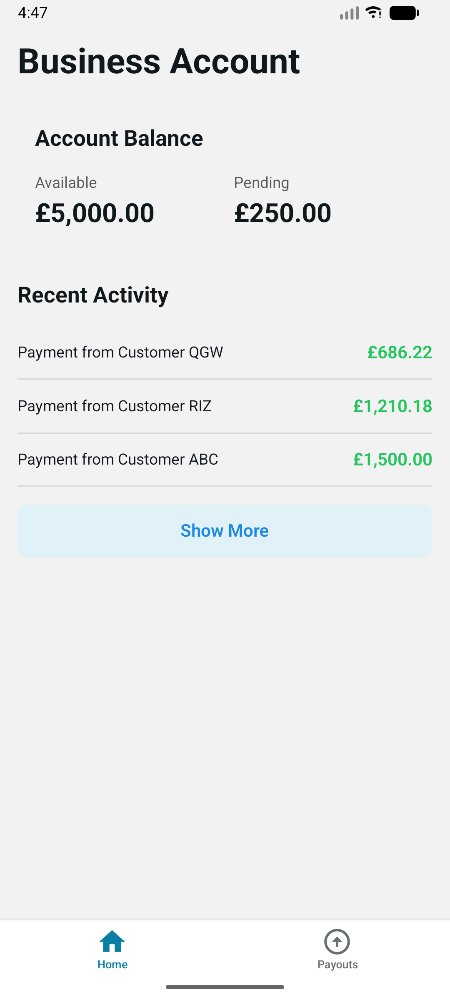</td>
</tr>
</tbody>
</table>

</details>


### Step 2: Transaction List

**Goal**: Display recent activity with enhanced functionality.

**Requirements**:

* Display the list of all activity items with type, description, amount, and date (formatted as `DD MM YYYY`).
* Implement "Infinite Scroll" functionality on the transaction list modal. Load more items automatically as the user scrolls to the bottom.
* Use cursor-based pagination to fetch additional activity items.
* Handle loading and error states gracefully.
* Group transactions by local date (Today / Yesterday / 18 May 2025).

<details>
<summary>📱 Reference Screenshots</summary>

<table>
<thead>
<tr>
<th>Loading</th>
<th>Loaded</th>
</tr>
</thead>
<tbody>
<tr>
<td>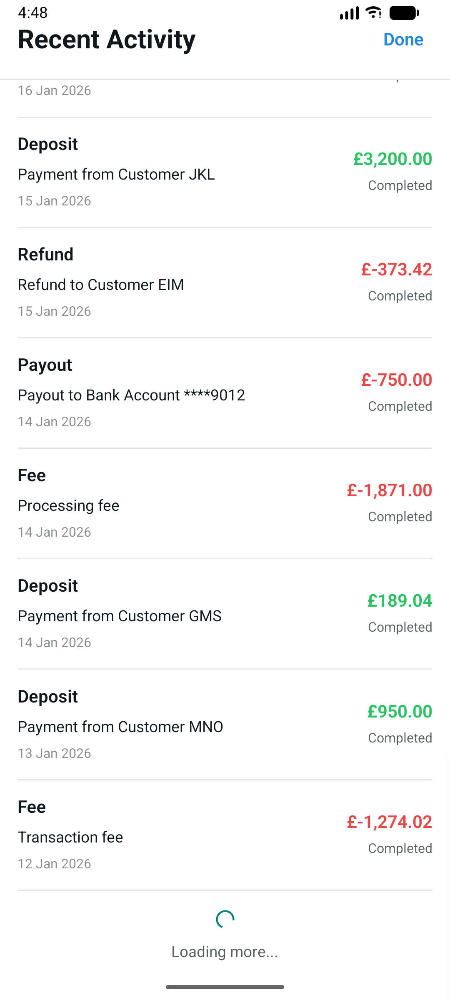</td>
<td>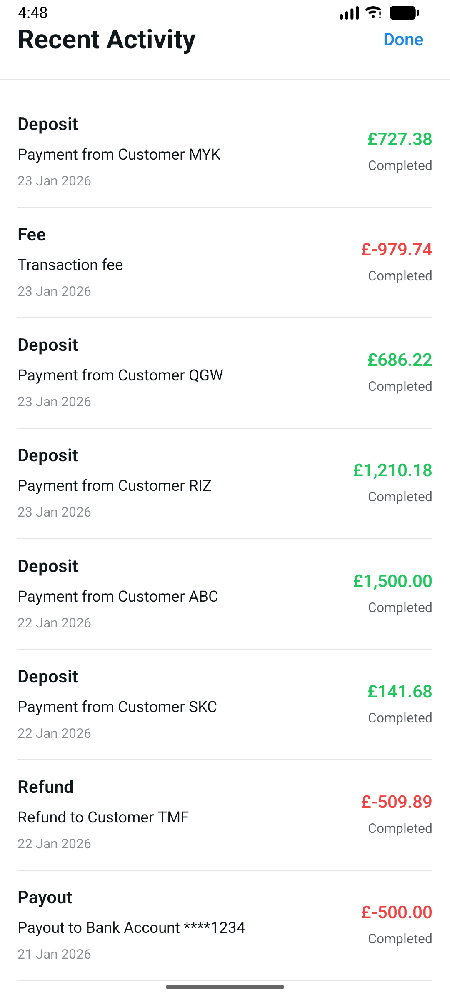</td>
</tr>
</tbody>
</table>

</details>


### Step 3: Payout Initiation Form & Confirmation

**Goal**: Create a screen for users to send a payout to a bank account with confirmation modal.

**Requirements**:

* Use a numeric input field for the payout amount.
* Use a dropdown to select the currency (`GBP` or `EUR`). The currency can be different from the merchant's account currency.
* Capture the destination IBAN 
  * Valid IBAN formats (e.g., `GB29NWBK60161331926819`).
  * Invalid IBAN format (e.g., `FR1212345123451234567A12310131231231231`).
* Ensure the "Confirm" button is disabled if the input is empty, zero, or negative.
* Display a confirmation screen summarizing the transaction before execution (as shown in the reference images).
* Handle success response by showing Payout confirmation with amount and currency.
* Handle failures (e.g., `4xx`, `5xx` errors, insufficient funds) and network errors.

<details>
<summary>📱 Reference Screenshots</summary>

<table>
<thead>
<tr>
<th>Form</th>
<th>Confirm</th>
<th>Confirmed</th>
</tr>
</thead>
<tbody>
<tr>
<td>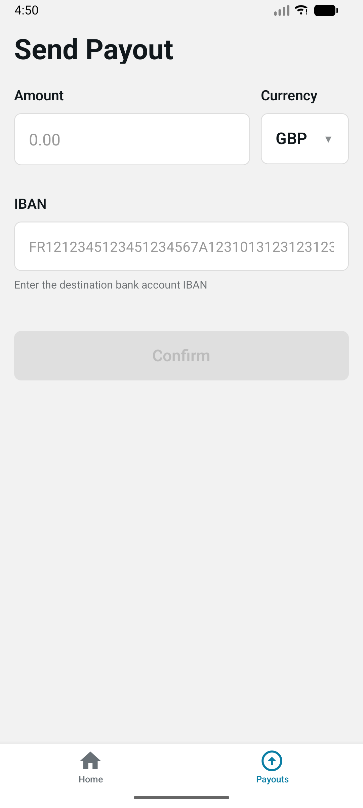</td>
<td>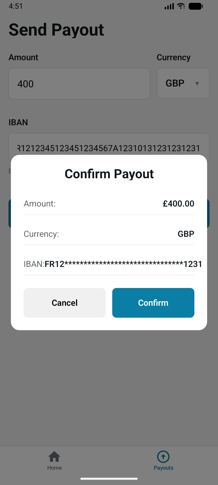</td>
<td>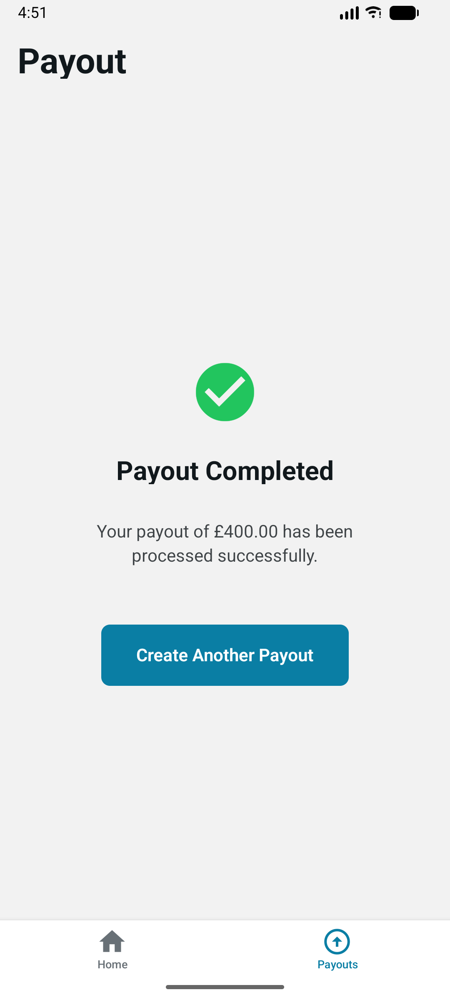</td>
</tr>
</tbody>
</table>

<table>
<thead>
<tr>
<th>Failed</th>
<th>Insufficient Funds</th>
</tr>
</thead>
<tbody>
<tr>
<td>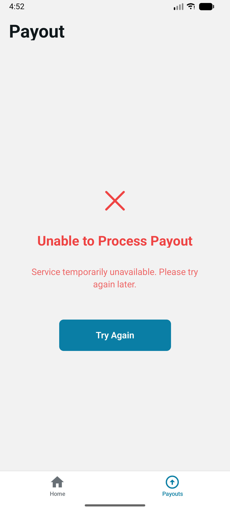</td>
<td>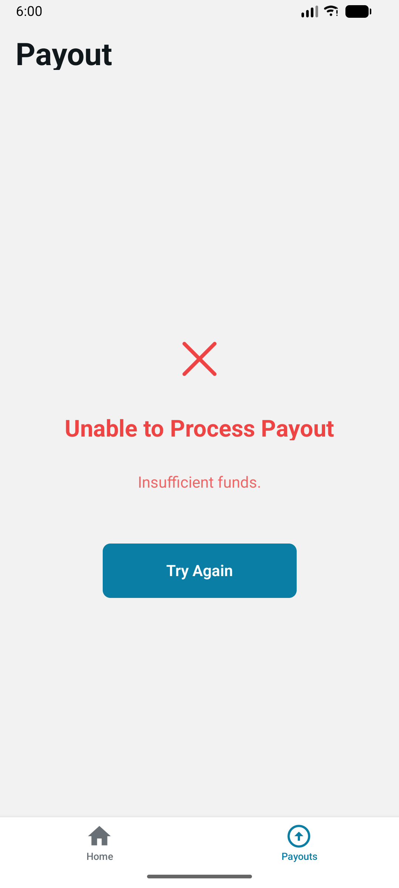</td>
</tr>
</tbody>
</table>

</details>


### Step 4: Device Identity

**Goal**: Identify the Merchant's device identifier and send as part of the Payout API request.

**Requirements**:

* Send a stable ID with the Payout request as `device_id`.

### Step 5: Biometric Authentication for Payouts over £1,000.00

**Goal**: Secure payouts over **£1,000.00** (100,000 pence) with biometric authentication.

**Requirements**:

* Before the `/api/payouts` call, check if the payout amount exceeds the threshold (`1,000.00` in the selected currency). If it does, await the native bridge. If the promise resolves `false`, abort the payout.
* If biometrics are not setup, inform the user to setup biometrics in the settings and abort the payout.

**Emulator setup:**
* Go to emulator **Settings → Security → Fingerprint** (or search "fingerprint") and enrol a fingerprint.
* Then use **Extended Controls (…) → Fingerprint** to simulate a touch during the biometric prompt.

<details>
<summary>📱 Reference Screenshots</summary>

<table>
<thead>
<tr>
<th>Prompt</th>
<th>Failed</th>
</tr>
</thead>
<tbody>
<tr>
<td>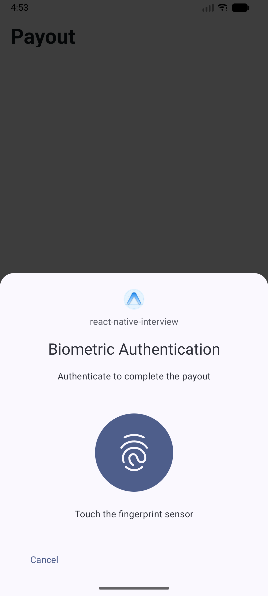</td>
<td>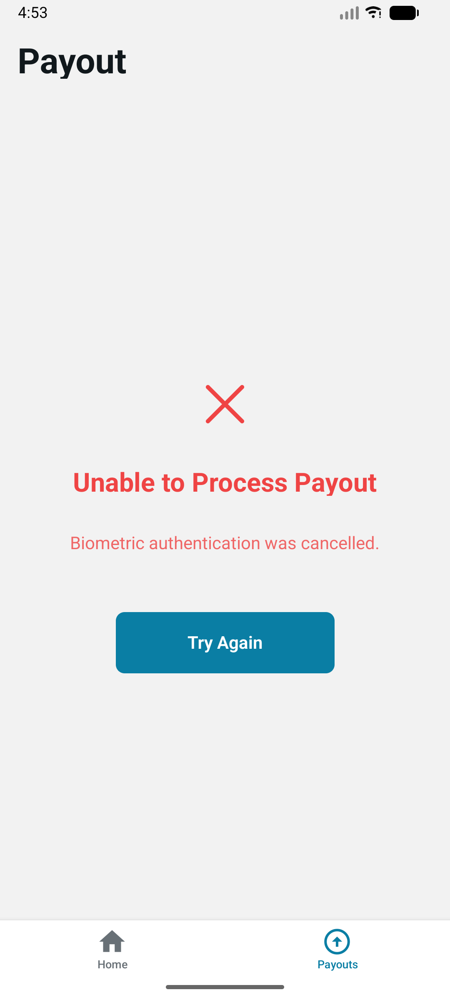</td>
</tr>
</tbody>
</table>

</details>


### Step 6: Screenshot Prevention

**Goal**: Make sure the Merchant is aware of the risk of screenshots on the Payout screen.

**Requirements**:

* **UI Reaction**: On the **Payout** screen, listen for screenshot event and show a non-intrusive warning (like a Toast or an Alert) reminding the user to keep their financial data private.

**Emulator testing:**
* Navigate to the Payout Form screen, then try taking a screenshot using the emulator toolbar's camera button or via `adb`:
  ```bash
  adb exec-out screencap -p > /tmp/payout_screenshot.png
  ```
* The captured image should be entirely black — this confirms `FLAG_SECURE` is active.
* Navigate back to the Home screen and repeat — the screenshot should capture normally, confirming the flag is scoped correctly to the Payout screens.

<details>
<summary>📱 Reference Screenshots</summary>

<table>
<thead>
<tr>
<th>Screenshot Warning (payout screen)</th>
</tr>
</thead>
<tbody>
<tr>
<td>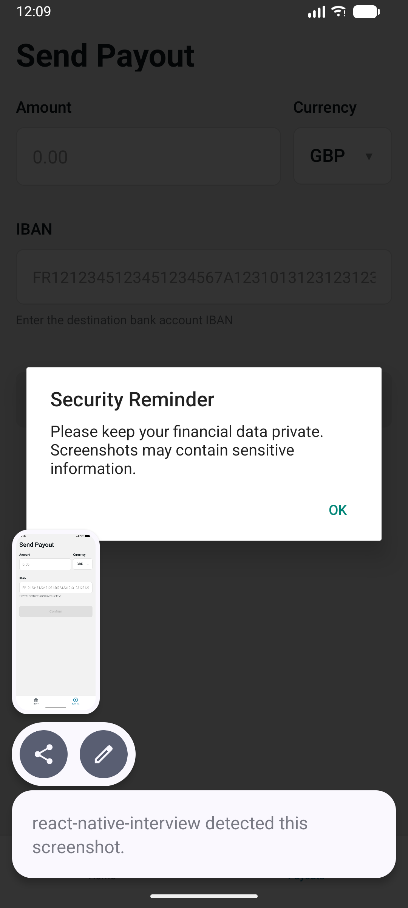</td>
</tr>
</tbody>
</table>

</details>
